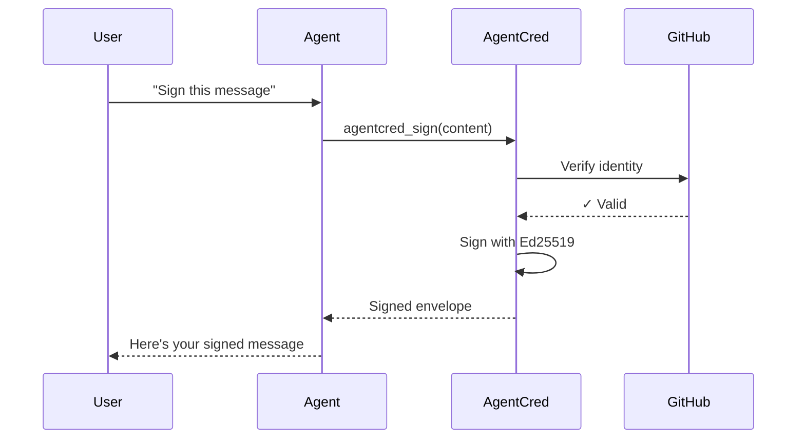

# @agentcred-ai/mcp-server

[](https://www.npmjs.com/package/@agentcred-ai/mcp-server)
[](https://opensource.org/licenses/MIT)
[](https://modelcontextprotocol.io)
[](https://smithery.ai/server/@agentcred-ai/mcp-server)

> **Cryptographic identity for AI agents.** Sign your agent's outputs with Ed25519 signatures tied to your GitHub identity. Prove which human is behind the agent.

## Why AgentCred MCP?

Your AI agent can now:
- ✅ **Sign outputs** with cryptographic proof of human operator
- ✅ **Verify signatures** from other agents
- ✅ **Establish trust** in multi-agent workflows
- ✅ **Prove accountability** for agent actions

**Use case**: You're using Claude to draft a contract. Sign the output with AgentCred, and your team can cryptographically verify it came from your agent, not a random bot.

---

## Quick Install

### One-Click Install (Recommended)

<details>
<summary><b>Claude Desktop</b></summary>

**macOS**: `~/Library/Application Support/Claude/claude_desktop_config.json`  
**Windows**: `%APPDATA%\Claude\claude_desktop_config.json`

```json
{
  "mcpServers": {
    "agentcred": {
      "command": "npx",
      "args": ["-y", "@agentcred-ai/mcp-server"]
    }
  }
}
```

Restart Claude Desktop. Done! 🎉

</details>

<details>
<summary><b>Cursor</b></summary>

**Config location**: `~/.cursor/mcp.json`

```json
{
  "mcpServers": {
    "agentcred": {
      "command": "npx",
      "args": ["-y", "@agentcred-ai/mcp-server"]
    }
  }
}
```

Or use the one-click install:

```
cursor://settings/mcp?server=agentcred&command=npx&args=-y,@agentcred-ai/mcp-server
```

Restart Cursor. Done! 🎉

</details>

<details>
<summary><b>VS Code (via Cline)</b></summary>

**Config location**: `.vscode/mcp.json` (workspace) or `~/.vscode/mcp.json` (global)

```json
{
  "mcpServers": {
    "agentcred": {
      "command": "npx",
      "args": ["-y", "@agentcred-ai/mcp-server"]
    }
  }
}
```

Restart VS Code. Done! 🎉

</details>

<details>
<summary><b>Windsurf</b></summary>

**Config location**: `~/.codeium/windsurf/mcp_config.json`

```json
{
  "mcpServers": {
    "agentcred": {
      "command": "npx",
      "args": ["-y", "@agentcred-ai/mcp-server"]
    }
  }
}
```

Restart Windsurf. Done! 🎉

</details>

<details>
<summary><b>Claude Code (CLI)</b></summary>

```bash
# Add to your shell config (~/.bashrc, ~/.zshrc, etc.)
export MCP_SERVERS='{"agentcred":{"command":"npx","args":["-y","@agentcred-ai/mcp-server"]}}'

# Or use inline:
MCP_SERVERS='{"agentcred":{"command":"npx","args":["-y","@agentcred-ai/mcp-server"]}}' claude-code
```

Done! 🎉

</details>

<details>
<summary><b>Zed</b></summary>

**Config location**: `~/.config/zed/settings.json`

```json
{
  "context_servers": {
    "agentcred": {
      "command": "npx",
      "args": ["-y", "@agentcred-ai/mcp-server"]
    }
  }
}
```

Restart Zed. Done! 🎉

</details>

---

## Authentication

AgentCred uses **GitHub OAuth Device Flow** by default (opens browser on first use). No manual token setup required!

### Option 1: OAuth Device Flow (Recommended)

1. Ask your AI agent: `"Initialize AgentCred"`
2. Agent calls `agentcred_init` → browser opens
3. Authorize on GitHub → Done!

### Option 2: Personal Access Token (Optional)

If you prefer manual token setup:

```json
{
  "mcpServers": {
    "agentcred": {
      "command": "npx",
      "args": ["-y", "@agentcred-ai/mcp-server"],
      "env": {
        "GITHUB_TOKEN": "ghp_your_token_here"
      }
    }
  }
}
```

---

## Usage Examples

### Example 1: Sign a Message

**You**: *"Sign this message with AgentCred: 'Contract approved by legal team'"*

**Claude**:
```json
{
  "agentcred": {
    "v": "1.0",
    "jws": "eyJhbGciOiJFZERTQSIsInR5cCI6ImFnZW50Y3JlZCtqd3QifQ...",
    "github": "yourname",
    "agent": "claude"
  },
  "content": "Contract approved by legal team"
}
```

✅ **Signed!** Anyone can verify this came from your agent.

### Example 2: Verify a Signature

**You**: *"Verify this AgentCred envelope: [paste envelope]"*

**Claude**:
```json
{
  "verified": true,
  "github": {
    "username": "yourname",
    "id": 12345
  },
  "agent": "claude",
  "timestamp": "2026-02-03T10:30:00Z"
}
```

✅ **Verified!** Signature is valid.

### Example 3: Check Current Identity

**You**: *"What's my AgentCred identity?"*

**Claude**:
```json
{
  "github": {
    "username": "yourname",
    "id": 12345
  },
  "fingerprint": "SHA256:abc123...",
  "registeredAt": "2026-02-03T10:00:00Z"
}
```

---

## Available Tools

| Tool | Description | Parameters |
|------|-------------|------------|
| `agentcred_init` | Initialize identity (links GitHub to Ed25519 keypair) | `github_token` (optional) |
| `agentcred_sign` | Sign content and return verifiable envelope | `content` (required), `agent` (optional) |
| `agentcred_verify` | Verify an AgentCred envelope | `envelope` (required, JSON string) |
| `agentcred_whoami` | Check current identity | None |

### Tool Details

<details>
<summary><b>agentcred_init</b></summary>

**Purpose**: Create or load your AgentCred identity.

**Parameters**:
- `github_token` (optional): GitHub PAT. If not provided, uses OAuth Device Flow.

**Example prompt**: *"Initialize AgentCred for me"*

**Returns**:
```
Identity initialized for yourname
Fingerprint: SHA256:abc123...
Registered at: 2026-02-03T10:00:00Z
```

</details>

<details>
<summary><b>agentcred_sign</b></summary>

**Purpose**: Sign any content with your identity.

**Parameters**:
- `content` (required): The text to sign
- `agent` (optional): Agent identifier (defaults to "default")

**Example prompt**: *"Sign this message: 'Hello world'"*

**Returns**: AgentCred envelope (JSON)

</details>

<details>
<summary><b>agentcred_verify</b></summary>

**Purpose**: Verify a signed envelope.

**Parameters**:
- `envelope` (required): JSON string of AgentCredEnvelope

**Example prompt**: *"Verify this envelope: {...}"*

**Returns**: Verification result with username, timestamp, and validity

</details>

<details>
<summary><b>agentcred_whoami</b></summary>

**Purpose**: Show your current identity.

**Parameters**: None

**Example prompt**: *"What's my AgentCred identity?"*

**Returns**: Identity information (username, fingerprint, registration time)

</details>

---

## Available Resources

AgentCred MCP provides 2 resources that your AI agent can read:

| Resource URI | Description | MIME Type |
|--------------|-------------|-----------|
| `agentcred://identity` | Current identity information | `application/json` |
| `agentcred://spec` | Link to protocol specification | `text/plain` |

**Example**: Your agent can read `agentcred://identity` to check if you're authenticated before attempting to sign.

---

## Troubleshooting

<details>
<summary><b>Error: "No identity configured"</b></summary>

**Cause**: You haven't initialized AgentCred yet.

**Solution**: Ask your agent: *"Initialize AgentCred"* or *"Run agentcred_init"*

</details>

<details>
<summary><b>OAuth Device Flow not working</b></summary>

**Cause**: Browser didn't open or you missed the authorization step.

**Solution**: Use Personal Access Token instead:
1. Create a GitHub PAT at https://github.com/settings/tokens
2. Add to config:
   ```json
   "env": {
     "GITHUB_TOKEN": "ghp_your_token"
   }
   ```
3. Restart your MCP client

</details>

<details>
<summary><b>Tools not showing up in Claude Desktop</b></summary>

**Checklist**:
1. ✅ Config file in correct location?
   - macOS: `~/Library/Application Support/Claude/claude_desktop_config.json`
   - Windows: `%APPDATA%\Claude\claude_desktop_config.json`
2. ✅ Valid JSON? (Use a JSON validator)
3. ✅ Restarted Claude Desktop?
4. ✅ Check logs: `~/Library/Logs/Claude/mcp*.log` (macOS)

</details>

<details>
<summary><b>Verification fails</b></summary>

**Common causes**:
- Envelope was modified after signing
- Signature expired (>24 hours old)
- Public key not registered

**Solution**: Re-sign the content or check envelope integrity.

</details>

---

## How It Works



**Protocol**: Ed25519 signatures (EdDSA) + JWS (RFC 7515) + SHA-256 content hashing

---

## Advanced Configuration

### Custom Storage Location

By default, keys are stored on disk in `~/.agentcred/keys`. For custom storage locations, use the CLI or SDK directly.

### Multiple Identities

Each MCP server instance manages one identity. To use multiple identities, configure multiple server instances:

```json
{
  "mcpServers": {
    "agentcred-work": {
      "command": "npx",
      "args": ["-y", "@agentcred-ai/mcp-server"],
      "env": {
        "GITHUB_TOKEN": "ghp_work_token"
      }
    },
    "agentcred-personal": {
      "command": "npx",
      "args": ["-y", "@agentcred-ai/mcp-server"],
      "env": {
        "GITHUB_TOKEN": "ghp_personal_token"
      }
    }
  }
}
```

---

## Related Packages

| Package | Description |
|---------|-------------|
| [`agentcred`](https://www.npmjs.com/package/agentcred) | Core SDK for Node.js/TypeScript |
| [`@agentcred-ai/cli`](https://www.npmjs.com/package/@agentcred-ai/cli) | Command-line tool |
| [`@agentcred-ai/vercel`](https://www.npmjs.com/package/@agentcred-ai/vercel) | Vercel AI SDK middleware |
| [`@agentcred-ai/mastra`](https://www.npmjs.com/package/@agentcred-ai/mastra) | Mastra framework integration |

---

## Documentation

- **Main README**: [../../README.md](../../README.md)
- **Beginner Guide**: [../../guide.md](../../guide.md)
- **Examples**: [../../examples/](../../examples/)

---

## Contributing

Found a bug? Have a feature request? [Open an issue](https://github.com/agentcred-ai/agentcred/issues) or submit a PR!

See [CONTRIBUTING.md](../../CONTRIBUTING.md) for development setup.

---

## Registry Submission

Want to add AgentCred to the official MCP registry?

1. **Official Registry**: Submit to https://github.com/modelcontextprotocol/servers
2. **Smithery**: Add to https://smithery.ai/submit
3. **GitHub Topics**: Add `mcp-server`, `agentcred`, `identity` topics to this repo

---

## License

MIT © AgentCred Contributors

---

## Support

- **Discord**: [Join our community](https://discord.gg/agentcred) *(coming soon)*
- **GitHub Issues**: [Report bugs](https://github.com/agentcred-ai/agentcred/issues)
- **Docs**: [agentcred.dev](https://agentcred.dev)
